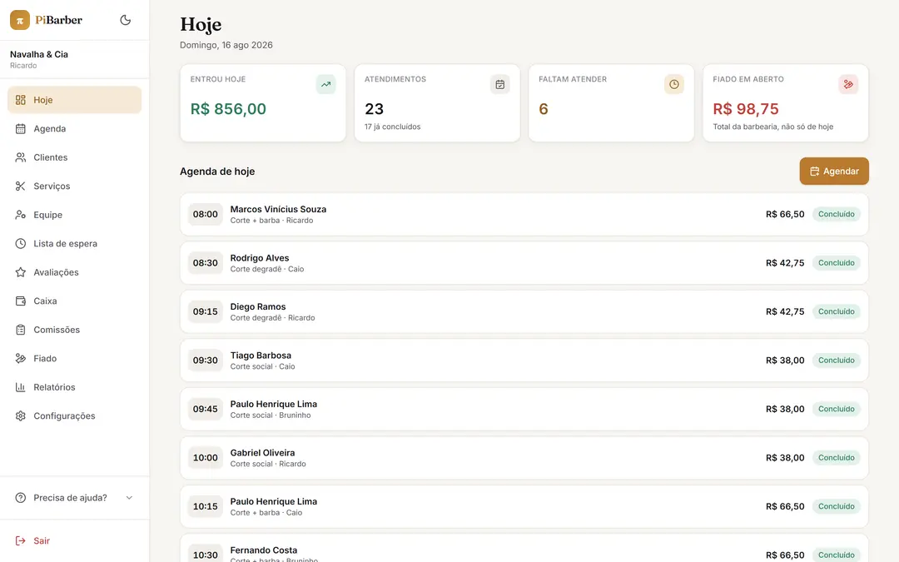

# PiBarber

**Plataforma de agendamento e gestão para barbearias.** Um cliente, uma conta — e a possibilidade de agendar em qualquer barbearia cadastrada.

🔗 **[pibarber.vercel.app](https://pibarber.vercel.app/)** · Projeto pessoal em desenvolvimento

<p align="center">
  
</p>

<p align="center">
  <em>Painel do dono: entrada do dia, atendimentos, fiado em aberto e a agenda completa</em>
</p>

<p align="center">
  
</p>

<p align="center">
  <em>App do cliente: próximo horário, agendamentos futuros e busca por barbearia</em>
</p>

---

## O problema

Barbearia pequena administra a agenda por WhatsApp e caderno. O resultado é previsível: horário marcado em duplicidade, cliente que não aparece e ninguém sabe, nenhum histórico de quem já passou por ali, e um dono que não tem ideia de quanto entrou no mês nem qual serviço puxa mais gente.

O PiBarber resolve isso sem exigir que a barbearia instale nada nem que o cliente baixe app de loja.

---

## Quem usa, e o que cada um vê

| Quem | Onde | O que faz |
|---|---|---|
| **Cliente** | `/app` | Encontra barbearias por nome, cidade ou proximidade no mapa; agenda, acompanha e avalia. Instala no celular como PWA |
| **Dono** | `/painel` | Agenda, clientes, equipe, serviços, caixa, comissão, fiado, fila de espera e relatórios |
| **Assistente** | `/painel` | O mesmo painel, com menu reduzido — sem nenhum dado financeiro |

Existe ainda `/b/[slug]`, o perfil público de cada barbearia com agendamento aberto, e `/admin`, por onde a plataforma cadastra novas lojas.

---

## As decisões que deram mais trabalho

**Separar dono de assistente foi mais do que esconder um botão.** A primeira versão escondia o menu financeiro no front-end — o que não protege nada, já que a API continua acessível. A permissão precisou descer até o banco: as regras de acesso ficam no Postgres, e chamar a API direto com a chave pública não passa pelo controle. O menu reduzido virou consequência, não a proteção em si.

**Impedir dois agendamentos no mesmo horário.** Validar isso na aplicação não resolve: dois pedidos simultâneos passam pelos dois lados da checagem. A garantia ficou no próprio banco, via constraint — o segundo agendamento conflitante simplesmente não é aceito.

**Erro de banco não é mensagem de usuário.** Toda operação de escrita traduz o erro do Postgres para português antes de chegar na tela. Ninguém deveria ler `duplicate key value` num app de barbearia.

**Data e hora sempre resolvidas no servidor**, no fuso `America/Sao_Paulo` — o horário do agendamento não pode depender do relógio do celular do cliente.

---

## Stack

`Next.js 15` · `TypeScript` · `Tailwind CSS v4` · `Supabase (Postgres + Auth)` · `Leaflet` · `Recharts` · `Vercel`

---

## Status

Em desenvolvimento ativo. O fluxo de agendamento, os três perfis de acesso e o painel administrativo estão funcionando.

Próximos passos: notificações de lembrete e relatório de desempenho por profissional.

---

## Rodar localmente

```bash
npm install
cp .env.example .env.local     # preencha as variáveis
npm run dev -- --port 3001
```

Abra `http://localhost:3001`. A porta importa: `NEXT_PUBLIC_SITE_URL` precisa refletir a porta real, senão o callback do login com Google volta para o lugar errado.

As variáveis obrigatórias vêm de **Project Settings → API** no Supabase:

```
NEXT_PUBLIC_SUPABASE_URL
NEXT_PUBLIC_SUPABASE_ANON_KEY
SUPABASE_SERVICE_ROLE_KEY      ← segredo, só servidor
NEXT_PUBLIC_SITE_URL
```

As demais estão no `.env.example`. Nenhuma quebra o build, mas cada uma desliga um pedaço da interface em silêncio.

### Banco

Os scripts ficam em `supabase/` e rodam no **SQL Editor**, na ordem numérica. Cada arquivo executa de ponta a ponta e traz o motivo no cabeçalho.

| Ordem | Arquivo | O que faz |
|---|---|---|
| 01 | `schema.sql` | Extensões, enums, tabelas, índices e a constraint de horário |
| 02 | `functions.sql` | Triggers, helpers e funções de negócio |
| 03 | `rls.sql` | Regras de acesso, policies e grants |
| 04 | `seed.sql` | 4 barbearias de exemplo, equipe, serviços e agendamentos |
| 05–06 | — | Operação: promover admin, limpar dados de teste |
| 07+ | — | Migrações, na ordem |

> Rode todas as migrações antes de subir o código: várias páginas do painel leem colunas e funções que só existem depois delas.

Contas do seed (senha `pibarber123`): `dono.saopaulo@pibarber.dev`, `cliente1@pibarber.dev` … `cliente6@pibarber.dev`.

### Scripts

```bash
npm run dev        # desenvolvimento
npm run build      # build de produção
npm run typecheck  # tsc --noEmit
npm run lint       # eslint
```

---

## Documentação

| Arquivo | Conteúdo |
|---|---|
| [docs/manual.md](docs/manual.md) | Manual completo: variáveis, deploy na Vercel, login com Google |
| [ESPECIFICACAO.md](ESPECIFICACAO.md) | Escopo, banco e telas |
| [docs/promover-dono.md](docs/promover-dono.md) | Cadastrar barbearia e promover o dono |
| [docs/imagens.md](docs/imagens.md) | Bucket do Storage e envio de imagens |

---

Feito por **Guilherme Pazoti** — [LinkedIn](https://www.linkedin.com/in/guilherme-pazoti)
